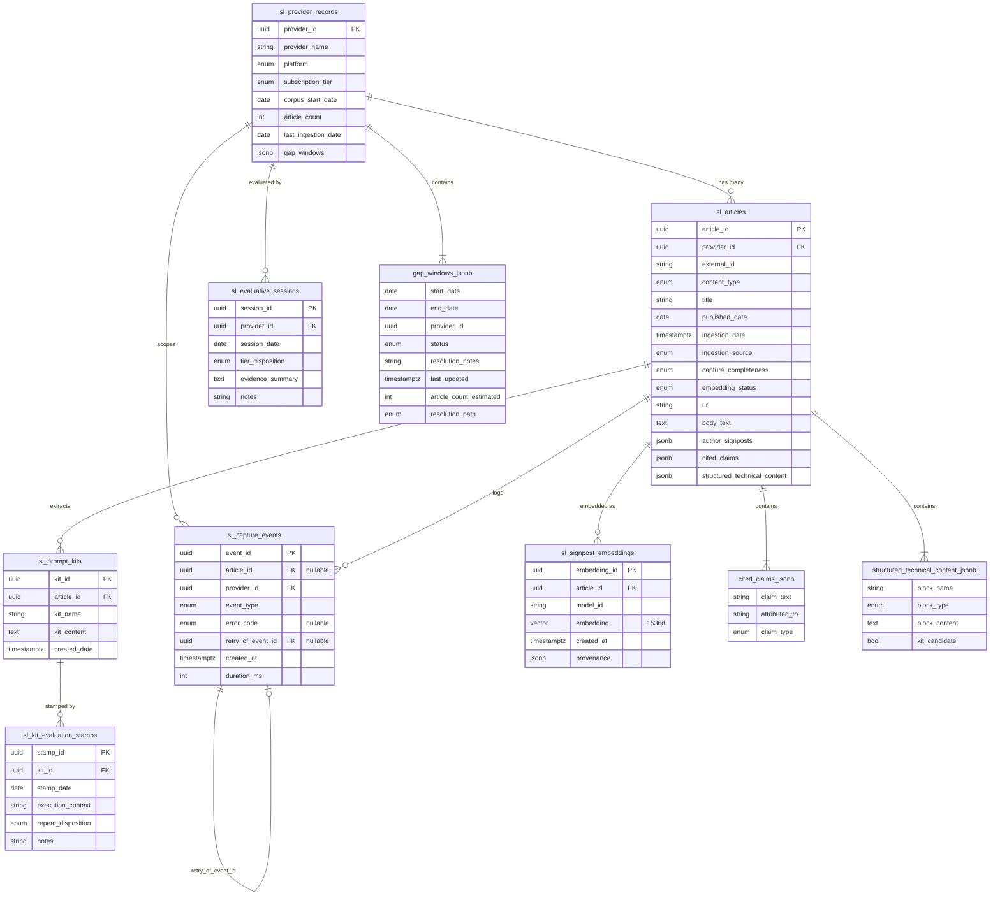
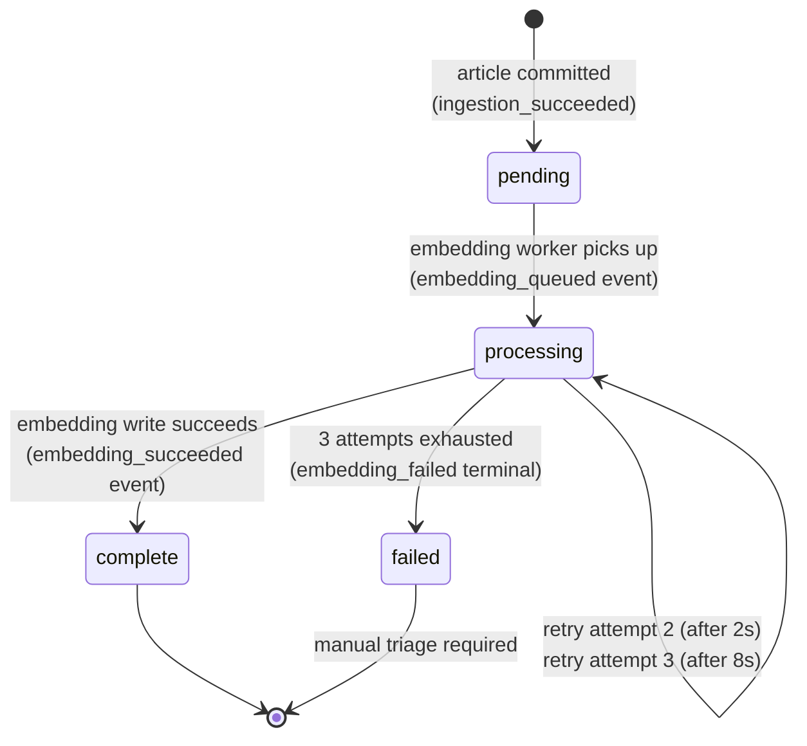
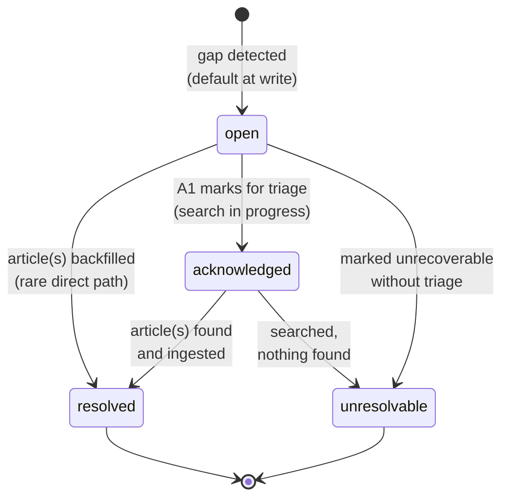

# Signal Ledger — Data Dictionary v0.3

**Status:** LOCKED — 2026-05-05
**Version:** v0.3
**LENS Chain Position:** Layer 3 of 7
**Depends On:** Charter v0.2 (LOCKED 2026-05-03), Use Case Spec v0.2 (LOCKED 2026-05-03)
**Precedes:** Functional Spec v1.1 (LOCKED 2026-05-05)
**Supersedes:** Data Dictionary v0.2 (LOCKED 2026-05-03)
**Triggered By:** ADR-013 (rate-limit budget governance for upstream content sources)
**Tag:** [signal-ledger:data-dictionary-v0.3]

---

## Changes from v0.2

This version applies the backward-flow correction triggered by ADR Log v0.1 (specifically ADR-013) per LENS Governance Addendum v0.1 principle G4. The correction is additive — no schema changes, no vocabulary changes, no entity changes. One new section is added. All v0.2 content is preserved unchanged.

| Change | Reason |
|---|---|
| **New § Upstream Source Properties** added between § Storage Architecture and § Entity Inventory | ADR-013 anticipates this section explicitly. Source properties are factual descriptions of upstream content sources (rate limits, auth model, endpoint shape, pagination, content types served) — distinct from the architectural decision to govern rate limits at the adapter layer, which is recorded in ADR-013. |
| Tag updated to `[signal-ledger:data-dictionary-v0.3]` | New version, new tag per handoff convention |

### Not changed in v0.3

- No new entities. ADR-013 anticipates persistent budget state but defers the schema shape to Functional Spec v1.1 / implementation. No `sl_api_call_ledger` table, no `budget_state` field on existing entities, no JSONB additions for budget tracking. v0.3 documents source-side facts only.
- No vocabulary corrections. v0.2 aligned to Functional Spec v1.0 vocabulary; v0.3 introduces no new drift.
- No state machine additions. The v0.2 state machines (E1 `embedding_status`, E6 gap window `status`) are unchanged.
- No index plan changes.
- No open question additions or closures from v0.2's set. OQ-DD-06 and OQ-DD-07 remain open with their v0.2 dispositions.

### Re-validation against Functional Spec v1.0

Functional Spec v1.0 does not reference upstream source properties as DD content. The new § Upstream Source Properties is additive context for FS v1.1 to consume; FS v1.0 requires no re-lock. The Functional Spec v1.1 work item authored alongside this DD revision is the consumer of the new section.

---

## Storage Architecture

| Decision | Resolution |
|---|---|
| Storage engine | pgvector on existing OB Supabase instance (`blreixaevpbmhbhyqgbq.supabase.co`) |
| Table namespace | `sl_*` prefix — co-located with OB, isolated by naming convention |
| Dedicated Supabase project | Rejected — free tier inactivity pause (1 week) is a production liability at Signal Ledger's periodic ingestion cadence |
| OB role | Canonical state bus only — charter, specs, session handoffs, governance commits. No article bodies. |
| Write path | Dedicated Signal Ledger MCP (Supabase Edge Function, same pattern as OB MCP). Supabase first-party MCP rejected — context bloat, overly broad tool surface. |
| AegisRelay | Deferred to its own productionalization sprint. Signal Ledger v2 migration path when proven. |
| Embedding model | `text-embedding-3-small`, 1536d (locked in Functional Spec § 2) |
| Vector index | HNSW (pgvector) — better query performance than IVFFlat at v1 corpus scale |

---

## Upstream Source Properties

This section documents factual properties of upstream content sources that Signal Ledger ingests from. These are not architectural decisions — the architectural decision to govern rate limits at the source-adapter layer is recorded in ADR-013. This section records *what each source actually is* so that adapter implementations and Functional Spec v1.1 budget-aware backfill behavior have a single canonical reference for source-side facts.

**Posture.** Source properties are facts about the source, not contracts Signal Ledger imposes. They change when the source changes them; they are not under Signal Ledger's control. Updates to this section are triggered by upstream announcements, observed behavior changes, or tier upgrades that surface previously-invisible properties (the canonical example: EC MCP rate limits became visible only after Jonathan's executive-tier upgrade on 2026-04-29).

**Scope.** v1 has one source: Executive Circle MCP. Future sources (Ruben Dominguez, Ken Huang, others) will be added as their adapters are authored. The "Future sources" placeholder below names the shape of those entries without attempting to populate them.

### Executive Circle MCP

The primary upstream content source for Nate B. Jones articles in v1.

| Property | Value | Source / Notes |
|---|---|---|
| Source identifier | `executive-circle-mcp` | Stable string used by adapter registry. Not a DB primary key — adapter-layer convention. |
| Provider scope | Nate B. Jones (v1 — single provider served by this source) | Source serves additional providers in principle; v1 adapter consumes the Nate scope only. |
| Auth model | OAuth token (executive-tier subscription credential) | Token lifecycle managed by EC MCP. Signal Ledger holds and refreshes per EC MCP documentation. |
| Rate limit — per minute | 120 requests / minute | Documented on EC MCP setup page, visible after executive-tier upgrade (2026-04-29). |
| Rate limit — per day | 2,000 requests / day | Same source as above. Reset semantics (rolling window vs. wall-clock midnight) not documented; treated as observable behavior by adapter. |
| Content types served | `Nate-feature-article`, `Nate-executive-briefing` | Matches Charter v0.2 §Scope content-type inventory for v1. |
| Endpoint shape | REST-style with article-list and article-detail endpoints | Specific endpoint URLs are adapter implementation detail; not documented at DD layer. |
| Pagination model | Cursor-based pagination on article-list endpoints | Cursor opaque, returned in response payload. Multi-page traversal is the typical backfill access pattern. |
| Response format | JSON with article body in markdown or HTML (varies by endpoint) | Body normalization to canonical form is adapter responsibility. |
| Failure modes — observed | HTTP 429 on rate limit; HTTP 5xx on transient upstream errors | Both classified as `RATE_LIMITED` and `TRANSIENT_DB_ERROR` (or `SYSTEM_ERROR`) respectively per Functional Spec § 4 error contract. |
| Failure modes — anticipated | Daily-budget exhaustion expected during initial backfill given v1 corpus size | Drives multi-day backfill design per Functional Spec v1.1 § 10. |

**Reset semantics note.** The 2,000 requests / day budget's reset model (rolling 24-hour window from first request, or wall-clock UTC midnight, or wall-clock provider-local midnight) is not documented on the setup page. Adapter implementation observes behavior on first multi-day backfill and records the inferred semantics in `sl_capture_events.metadata` for audit. The adapter does not assume a reset model; it tracks budget consumption against observed reset events.

**Token lifecycle note.** OAuth token rotation cadence is governed by EC MCP, not Signal Ledger. Token expiration mid-backfill is treated as a transient failure (re-auth, resume) rather than a backfill-aborting condition. Token storage discipline follows ADR-003 (service-role-key handling discipline) by extension — same posture, different credential.

**Coverage gap note.** The February 12–21 gap window predates this source's index (which begins 2026-02-22). EC MCP cannot serve articles from that window. The gap is sourced via email-backfill per Charter v0.2 §Scope and ADR-005 (URL-resolution verification at email-backfill ingestion). EC MCP source properties are not the limiting constraint on the gap window.

### Future sources (placeholder)

Subsequent sources (Ruben Dominguez, Ken Huang, others) follow the same property schema:

- Source identifier (stable string)
- Provider scope (which providers are served by this source)
- Auth model
- Rate limit — per minute / per hour / per day, as applicable
- Content types served
- Endpoint shape
- Pagination model
- Response format
- Failure modes — observed and anticipated

Each new source authored adds one sub-section here at the time the corresponding adapter is implemented. Sources are not added speculatively; an entry exists when an adapter exists.

**Cross-source coordination posture.** Per ADR-013, sources have independent rate-limit budgets and independent adapters. There is no cross-source rate-limit pool, no shared scheduler, no global request budget. Each source is its own envelope.

---

## Entity Inventory

| ID | Entity | Table | Type | Notes |
|---|---|---|---|---|
| E1 | Article | `sl_articles` | Primary artifact | One record per ingested piece of content |
| E1a | CitedClaim | Embedded in `sl_articles.cited_claims` | JSONB array | Structured citations extracted from body |
| E1b | StructuredBlock | Embedded in `sl_articles.structured_technical_content` | JSONB array | Frameworks, models, methodologies |
| E2 | Prompt Kit | `sl_prompt_kits` | Extracted artifact | FK → E1 |
| E3 | Prompt Kit Evaluation Stamp | `sl_kit_evaluation_stamps` | Accumulating sub-record | FK → E2. Never overwritten. |
| E4 | Provider Record | `sl_provider_records` | First-class entity | One row v1 (Nate B. Jones) |
| E5 | Evaluative Session | `sl_evaluative_sessions` | Accumulating record | FK → E4. Never overwritten. |
| E6 | Gap Window | Embedded in `sl_provider_records.gap_windows` | JSONB array | Sub-record of E4 |
| E7 | Capture Event | `sl_capture_events` | Append-only audit trail | FK → E1 (nullable for pre-article failures), FK → E4. Never updated, never deleted. |
| E8 | Signpost Embedding | `sl_signpost_embeddings` | Vector storage | FK → E1. Unique constraint on `(article_id, model_id)`. |

---

## Entity-Relationship Diagram

**Cardinality notes:**
- `sl_provider_records` 1 : N `sl_articles` — one provider has many articles.
- `sl_articles` 1 : N `sl_prompt_kits` — one article may yield many kits (most yield zero).
- `sl_articles` 1 : N `sl_signpost_embeddings` — one article has at most one embedding per `model_id`. v1 ships with one model, so cardinality is effectively 1 : 1 in practice; the schema permits multi-model storage for future migration without rework.
- `sl_articles` 1 : N `sl_capture_events` — one article has many events across its ingestion lifecycle.
- `sl_capture_events` self-reference via `retry_of_event_id` — strict chain, traceable back to `ingestion_started`.
- JSONB sub-records (`gap_windows`, `cited_claims`, `structured_technical_content`) are arrays embedded in their parent rows — not separate tables. Diagrammed for clarity, not as separate relations.

---

## E1 — ARTICLE (`sl_articles`)

| Field | Type | Required | Valid Values / Format | Description | Source |
|---|---|---|---|---|---|
| `article_id` | UUID | ✅ | System-generated | Stable identifier | A2 at ingestion |
| `provider_id` | UUID (FK → E4) | ✅ | Must match active Provider Record | Links article to provider | A2 at ingestion |
| `external_id` | String | ✅ | Substack post slug or equivalent stable source identifier | Idempotency component. Combined with `provider_id` forms the unique constraint enforcing zero-duplicate guarantee per Functional Spec § 5. | A2 at ingestion (derived from source) |
| `content_type` | Enum | ✅ | `Nate-feature-article` \| `Nate-executive-briefing` | Content classification. Historical previews carry `capture_completeness: preview-only`; retired `Nate-executive-briefing-preview` type not used for new records | A2 at ingestion |
| `title` | String | ✅ | Free text | Article title as published | Source (A3) |
| `published_date` | Date | ✅ | `YYYY-MM-DD` | Date of original publication — immutable provenance (P3) | Source (A3) |
| `ingestion_date` | Timestamptz | ✅ | ISO 8601 UTC | When A2 wrote the record | A2 at ingestion |
| `ingestion_source` | Enum | ✅ | `web` \| `email-backfill` | Acquisition path (P12) | A2 at ingestion |
| `capture_completeness` | Enum | ✅ | `complete` \| `preview-only` \| `partial` | Degree of content captured. `complete` = full body present. `preview-only` = paywall-gated, excerpt only. `partial` = degraded capture (truncation, rendering failure). | A2 at ingestion |
| `embedding_status` | Enum | ✅ | `pending` \| `processing` \| `complete` \| `failed` | Embedding pipeline lifecycle state. Default `pending` at article commit. Transitions to `complete` on successful embedding write to E8, or `failed` after 3 attempts exhausted. See state machine diagram below. Per Functional Spec § 2. | A2 |
| `url` | String | ❌ | Valid URL or null | Canonical Substack URL. Null permitted for email-backfill records where URL is unresolvable. | Source (A3) |
| `body_text` | Text | Conditional | Non-empty when `capture_completeness` ≠ `preview-only` | Full article body as extracted. Verbatim. | Source (A3) |
| `author_signposts` | JSONB (Array\<String\>) | ❌ | Free text strings; empty array if none | A2-extracted phrases marking Nate's explicit rhetorical signals ("The key insight here…", "What I'm watching…"). P7 privileged targets. | A2 |
| `cited_claims` | JSONB (Array\<E1a\>) | ❌ | See E1a schema; empty array if none | Structured citations extracted from body. P8 first-class artifact. | A2 |
| `structured_technical_content` | JSONB (Array\<E1b\>) | ❌ | See E1b schema; empty array if none | Frameworks, models, named methodologies extracted from body. P8 first-class artifact. | A2 |

**Constraints:**
- Unique on `(provider_id, external_id)` — idempotency key per Functional Spec § 5.

**Note on `embedding` field:** v0.1 placed an `embedding vector(1536)` column directly on `sl_articles`. v0.2 removed it; embeddings live in E8 (`sl_signpost_embeddings`) per Functional Spec § 2. This remains the case in v0.3.

### E1a — CitedClaim (JSONB object schema)

| Field | Type | Required | Description |
|---|---|---|---|
| `claim_text` | String | ✅ | The claim as stated in the article |
| `attributed_to` | String | ❌ | Person, organization, or source cited by Nate. Null if uncited. |
| `claim_type` | Enum | ✅ | `statistic` \| `assertion` \| `prediction` \| `attribution` — extend post-backfill if additional types surface |

### E1b — StructuredBlock (JSONB object schema)

| Field | Type | Required | Description |
|---|---|---|---|
| `block_name` | String | ✅ | Name or label of the framework, model, or methodology |
| `block_type` | Enum | ✅ | `framework` \| `model` \| `methodology` \| `taxonomy` \| `heuristic` |
| `block_content` | Text | ✅ | Extracted content, verbatim or A2-paraphrased |
| `kit_candidate` | Boolean | ✅ | True if A2 flagged as prompt kit extraction candidate |

---

## E2 — PROMPT KIT (`sl_prompt_kits`)

| Field | Type | Required | Valid Values / Format | Description | Source |
|---|---|---|---|---|---|
| `kit_id` | UUID | ✅ | System-generated | Stable identifier | A2 at creation |
| `article_id` | UUID (FK → E1) | ✅ | Must match existing Article record | Source article | A2 at creation |
| `kit_name` | String | ✅ | Free text | Human-readable kit name | A2 at creation |
| `kit_content` | Text | ✅ | Prompt text | The extractable prompt or template | A2 at creation |
| `created_date` | Timestamptz | ✅ | ISO 8601 UTC | When kit was first written | A2 at creation |

*Evaluation stamps live in `sl_kit_evaluation_stamps` (E3), not embedded in this table. Query by `kit_id` to retrieve stamp history. Empty stamp set = unevaluated (default state).*

---

## E3 — PROMPT KIT EVALUATION STAMP (`sl_kit_evaluation_stamps`)

*Accumulating. One row per evaluation event. Never updated or deleted. Each A1 review appends a new row.*

| Field | Type | Required | Valid Values / Format | Description | Source |
|---|---|---|---|---|---|
| `stamp_id` | UUID | ✅ | System-generated | Stable identifier | A2 at write |
| `kit_id` | UUID (FK → E2) | ✅ | Must match existing Prompt Kit | Kit being evaluated | A2 at write |
| `stamp_date` | Date | ✅ | `YYYY-MM-DD` | Date A1 performed the evaluation | A1 declares → A2 writes |
| `execution_context` | String | ✅ | Free text | Session or situation in which the kit was executed (e.g., "LucidLink interview prep 2026-04-15"). Kit must have been executed — stamps are not written for unexecuted kits. | A1 |
| `repeat_disposition` | Enum | ✅ | `repeat-scheduled` \| `conditionally-deferred` \| `one-time` | A1's declared forward disposition. **Unevaluated is not a valid value — it is the structural absence of any stamp record.** | A1 |
| `notes` | String | ❌ | Free text | Optional A1 commentary on execution outcome | A1 |

---

## E4 — PROVIDER RECORD (`sl_provider_records`)

| Field | Type | Required | Valid Values / Format | Description | Source |
|---|---|---|---|---|---|
| `provider_id` | UUID | ✅ | System-generated | Stable identifier | A2 at creation |
| `provider_name` | String | ✅ | Free text | Human name of content provider | A1 |
| `platform` | Enum | ✅ | `Substack` (v1 only) | Publishing platform | A1 |
| `publication_name` | String | ❌ | Free text or null | Newsletter name if distinct from provider name | Source (A3) |
| `publication_url` | String | ❌ | Valid URL or null | Root URL of publication | Source (A3) |
| `subscription_tier` | Enum | ✅ | `free` \| `paid` | A1's subscription level at time of last update | A1 |
| `corpus_start_date` | Date | ✅ | `YYYY-MM-DD` | Earliest article date in scope. v1 = 2026-02-12. | A1 (Charter) |
| `article_count` | Integer | ✅ | ≥ 0 | Running count of ingested articles. Updated at each ingestion. | A2 |
| `last_ingestion_date` | Date | ❌ | `YYYY-MM-DD` or null | Date of most recent successful ingestion | A2 |
| `gap_windows` | JSONB (Array\<E6\>) | ❌ | See E6 schema; empty array if no gaps | Known ingestion gaps | A2 |

---

## E5 — EVALUATIVE SESSION (`sl_evaluative_sessions`)

*Accumulating. One row per evaluation event. Never updated or deleted.*

| Field | Type | Required | Valid Values / Format | Description | Source |
|---|---|---|---|---|---|
| `session_id` | UUID | ✅ | System-generated | Stable identifier | A2 at creation |
| `provider_id` | UUID (FK → E4) | ✅ | Must match existing Provider Record | Provider being evaluated | A2 |
| `session_date` | Date | ✅ | `YYYY-MM-DD` | Date A1 conducted the session | A1 declares → A2 writes |
| `tier_disposition` | Enum | ✅ | `maintain-current-tier` \| `upgrade-candidate` \| `degradation-signal` \| `abandon-signal` | A1's tier conclusion for this session | A1 |
| `evidence_summary` | Text | ✅ | Free text | A1's stated basis for the disposition. Required — disposition without stated evidence is not a valid record. | A1 |
| `notes` | String | ❌ | Free text | Optional extended commentary | A1 |

---

## E6 — GAP WINDOW (JSONB object schema, embedded in E4)

| Field | Type | Required | Valid Values / Format | Description | Source |
|---|---|---|---|---|---|
| `start_date` | Date | ✅ | `YYYY-MM-DD` | First date of gap window | A1 or A2 detection |
| `end_date` | Date | ✅ | `YYYY-MM-DD` | Last date of gap window (inclusive) | A1 or A2 detection |
| `provider_id` | UUID | ✅ | Must match parent record's `provider_id` | Denormalized for query convenience and audit | A2 at write |
| `status` | Enum | ✅ | `open` \| `acknowledged` \| `resolved` \| `unresolvable` | Default: `open` at detection. See state machine diagram below. | A2; updated by A1 |
| `article_count_estimated` | Integer | ❌ | ≥ 0 or null | Estimated articles published in window, if knowable | A1 or A2 |
| `resolution_path` | Enum | ❌ | `web` \| `email-backfill` \| `none` or null | Path used or planned. Null until resolution attempted. | A1 |
| `resolution_notes` | String | ❌ | Free text or null | Optional commentary on resolution outcome | A1 |
| `last_updated` | Timestamptz | ✅ | ISO 8601 UTC | Required for optimistic locking per Functional Spec § 7. Mismatch on read-vs-write rejects the write. | A2 at every mutation |

*v1 known gap: 2026-02-12 through 2026-02-21 (~10 articles). resolution_path: email-backfill. status: open.*

---

## E7 — CAPTURE EVENT (`sl_capture_events`)

*Append-only audit trail. Never updated, never deleted. Every state transition in the ingestion or embedding lifecycle writes a new row. Per Functional Spec § 3.*

| Field | Type | Required | Valid Values / Format | Description | Source |
|---|---|---|---|---|---|
| `event_id` | UUID | ✅ | System-generated, globally unique | Stable identifier; surfaced in error responses per Functional Spec § 4 | A2 |
| `article_id` | UUID (FK → E1) | Conditional | Required when event references an existing article. Null permitted for pre-article failures (e.g., `ingestion_started` followed by validation error before article write). | Article this event pertains to | A2 |
| `provider_id` | UUID (FK → E4) | ✅ | Must match active Provider Record | Provider scope for the event | A2 |
| `event_type` | Enum | ✅ | `ingestion_started` \| `ingestion_succeeded` \| `ingestion_failed` \| `embedding_queued` \| `embedding_succeeded` \| `embedding_failed` \| `retry_attempted` | Event classification per Functional Spec § 3 required event types | A2 |
| `error_code` | Enum | Conditional | `DUPLICATE_ARTICLE` \| `VALIDATION_ERROR` \| `SCHEMA_VIOLATION` \| `EMBEDDING_FAILURE` \| `RATE_LIMITED` \| `TRANSIENT_DB_ERROR` \| `SYSTEM_ERROR`. Null on success events. Required on failure events. | Error classification per Functional Spec § 4 error contract table | A2 |
| `retry_of_event_id` | UUID (FK → E7, self-reference) | Conditional | Required when `event_type = retry_attempted`. Null otherwise. | Strict chain reference per Functional Spec § 5. Each retry references its immediate predecessor; chain is traceable back to `ingestion_started`. | A2 |
| `created_at` | Timestamptz | ✅ | ISO 8601 UTC | Wall-clock event time. Best-effort ordering basis per Functional Spec § 3 ordering guarantees. | A2 |
| `duration_ms` | Integer | ❌ | ≥ 0 or null | Wall time for the operation that produced the event. Optional; populated where measurement is meaningful (article writes, embedding API calls). | A2 |
| `metadata` | JSONB | ❌ | Free-form object or null | Extension point for event-specific context not covered by the columns above (e.g., HTTP status codes, embedding-API response IDs, observed rate-limit reset events per § Upstream Source Properties). Optional. | A2 |

**Constraints:**
- No update, no delete — append-only at the application and operational discipline level. Postgres permits both; the system does not perform either.
- `retry_of_event_id` references `event_id` on the same table (self-FK). The reference must resolve — orphan retries are a schema violation.

**Source-of-truth posture (per Functional Spec § 3):** `sl_articles` is operational truth. `sl_capture_events` is audit trail. State is read from `sl_articles`, never derived from event log replay.

**Traceability requirement:** Given only `sl_capture_events` and an `article_id`, a full ingestion timeline must be reconstructible. If field set above is insufficient to satisfy this, the event schema is incomplete and a v0.4 backward-flow correction is required.

---

## E8 — SIGNPOST EMBEDDING (`sl_signpost_embeddings`)

*Vector storage. One row per `(article_id, model_id)` pair. Per Functional Spec § 2.*

| Field | Type | Required | Valid Values / Format | Description | Source |
|---|---|---|---|---|---|
| `embedding_id` | UUID | ✅ | System-generated | Stable identifier | A2 |
| `article_id` | UUID (FK → E1) | ✅ | Must match existing Article record | Article this embedding represents | A2 |
| `model_id` | String | ✅ | `text-embedding-3-small` (v1 lock) | Embedding model identifier. String literal in v1; promotable to FK reference if a model registry table is added in a future version. | A2 |
| `embedding` | vector(1536) | ✅ | pgvector format, 1536 dimensions | Semantic embedding of body_text (or title + excerpt for `preview-only` articles, per Functional Spec § 2 model lock). | A2 |
| `created_at` | Timestamptz | ✅ | ISO 8601 UTC | When the embedding row was written | A2 |
| `provenance` | JSONB | ✅ | Object containing model API metadata | Per Functional Spec § 2: provenance metadata written on every embedding row. Recommended fields: `model_version`, `api_response_id`, `input_token_count`. Required as non-null; specific shape evolves with provider responses. | A2 |

**Constraints:**
- **Unique on `(article_id, model_id)`** — duplicate embedding writes blocked at DB level per Functional Spec § 2 idempotency model. Application layer checks before write; DB constraint is the authoritative backstop.

**Forward compatibility:** v1 ships with one model; the schema permits multi-model embedding storage without migration. Adding a second model is additive — new rows under the new `model_id` value.

---

## State Machines

### E1 — `sl_articles.embedding_status` lifecycle

**Notes:**
- `pending` is the entry state set at article commit per Functional Spec § 2.
- `processing` is the active-attempt state; the self-loop represents the 3-attempt retry cadence (Attempt 1 → wait 2s → Attempt 2 → wait 8s → Attempt 3 → terminal). The wait intervals live in the worker, not as separate machine states.
- `complete` and `failed` are terminal. Per Functional Spec § 2, once `failed` no further automatic retry occurs; manual triage decides whether to resubmit.
- A successful retry from `processing` → `complete` collapses through the same edge as a first-attempt success.

### E6 — Gap Window `status` lifecycle

**Notes:**
- `open` is the entry state at gap detection per Functional Spec § 7 lifecycle.
- `acknowledged` is the manual-triage-in-progress state — A1 has marked it for active resolution.
- Direct `open` → `resolved` and `open` → `unresolvable` transitions are permitted but rare. `acknowledged` is the typical path.
- `resolved` and `unresolvable` are terminal.
- All transitions write through the optimistic-locking mechanism in Functional Spec § 7: `last_updated` timestamp is checked on read; mismatch on write rejects the mutation.

---

## Index Plan

| Table | Field(s) | Index Type | Retrieval Mode Served |
|---|---|---|---|
| `sl_articles` | `provider_id, external_id` | Unique B-tree | Idempotency enforcement (Functional Spec § 5) |
| `sl_articles` | `embedding_status` | B-tree | Embedding worker queue scan |
| `sl_articles` | `published_date` | B-tree | Targeted, Audit |
| `sl_articles` | `provider_id, content_type` | Composite B-tree | Filtered retrieval |
| `sl_articles` | `capture_completeness` | B-tree | Audit |
| `sl_kit_evaluation_stamps` | `kit_id, stamp_date` | Composite B-tree | Kit Status |
| `sl_evaluative_sessions` | `provider_id, session_date` | Composite B-tree | Evaluative longitudinal |
| `sl_capture_events` | `article_id, created_at` | Composite B-tree | Per-article timeline reconstruction |
| `sl_capture_events` | `event_type, created_at` | Composite B-tree | Observability metrics scans |
| `sl_capture_events` | `retry_of_event_id` | B-tree | Retry chain traversal |
| `sl_signpost_embeddings` | `article_id, model_id` | Unique B-tree | Idempotency enforcement (Functional Spec § 2) |
| `sl_signpost_embeddings` | `embedding` | HNSW (pgvector) | All semantic retrieval modes |

---

## Open Questions

| OQ ID | Question | Status |
|---|---|---|
| OQ-DD-01 | Storage format | **Closed** (v0.2) — pgvector on OB Supabase instance, `sl_*` tables |
| OQ-DD-02 | `body_text` storage — large article bodies in Postgres text column | **Closed** (v0.2) — Postgres text column confirmed sufficient at v1 corpus scale |
| OQ-DD-03 | CitedClaim `claim_type` exhaustiveness | **Low priority** — extend post-backfill sample if additional types surface |
| OQ-DD-04 | `article_count` maintenance pattern | **Closed** (v0.2) — native Postgres UPDATE on each ingestion |
| OQ-DD-05 | Write path selection | **Closed** (v0.2) — dedicated Signal Ledger MCP |
| OQ-DD-06 | E7 `metadata` field shape — schema-constrained or free-form | **Open** — defer until observability instrumentation reveals consistent fields |
| OQ-DD-07 | E8 `provenance` field shape — typed sub-record | **Open** — defer until first production use surfaces what the embedding API returns at scale |

No new open questions in v0.3. Budget state persistence — anticipated by ADR-013 — is deferred to Functional Spec v1.1 / implementation per session 6 prep decision (2026-05-05). It is not raised as a DD-level OQ because the decision to defer was the resolution.

---

## Tag

`[signal-ledger:data-dictionary-v0.3]`

---

*Signal Ledger Data Dictionary v0.3 — LOCKED 2026-05-05. Supersedes v0.2.*
*Backward-flow correction per LENS Governance Addendum v0.1 principle G4. Triggered by ADR-013 (rate-limit budget governance for upstream content sources). Additive only — one new section (Upstream Source Properties); no schema, vocabulary, state machine, or index changes from v0.2.*
